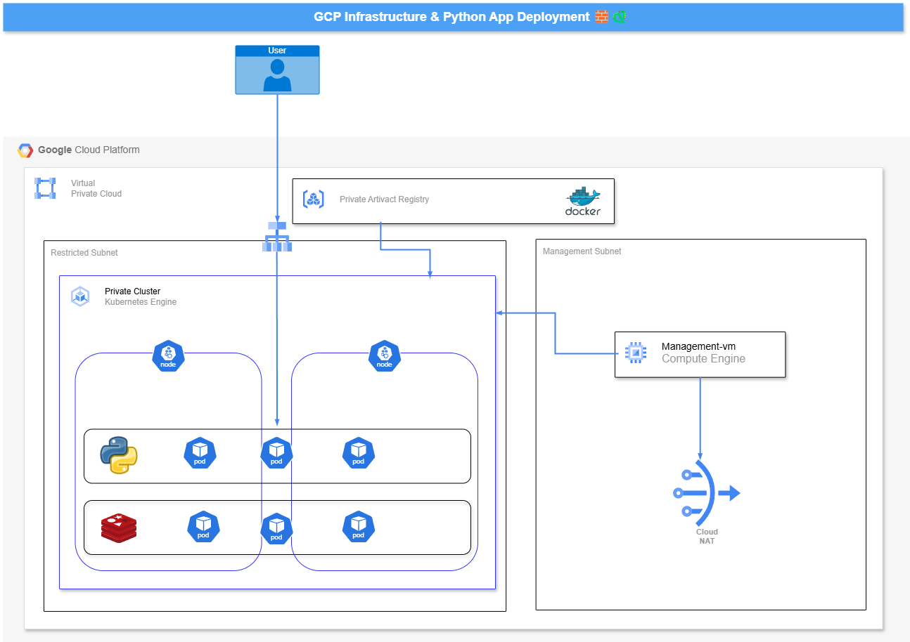

# 🛠️ GCP Infrastructure & Python App Deployment

This project demonstrates how to build and deploy a Python-based web application on **Google Cloud Platform (GCP)** using **Terraform**, **Kubernetes**, and **GCP-native services**.

---
## Project Diagram


---

## 📁 Project Structure
```text
├── Application Code/
│   ├── static/                       # Static assets (CSS, JS)
│   ├── templates/                    # HTML templates for the Flask app
│   ├── tests/                        # Test files (if any)
│   ├── .dockerignore                 # Files ignored by Docker build
│   ├── .env                          # Environment variables for app (optional)
│   ├── .gitignore                    # Git ignored files
│   ├── Dockerfile                    # Dockerfile for Flask app
│   ├── hello.py                      # Main Flask application
│   ├── LICENSE                       # License file
│   ├── README.md                     # Project documentation (you are here)
│   └── requirements.txt              # Python dependencies
│
├── K8s/
│   ├── python-app-deployment.yaml     # Deployment & Service for Flask app
│   ├── ingress.yaml                   # Ingress configuration
│   └── redis.yaml                     # Deployment & Service for Redis
│
└── terraform/
    ├── main.tf                 # Core infrastructure
    ├── provider.tf             # Google provider config
    ├── terraform.tfvars        # Variable values
    ├── variables.tf            # Input variable definitions
    ├── outputs.tf              # Outputs for the main
    ├── gke/ # GKE-specific Terraform config
        ├──main.tf              # main code for module 
        ├──outputs.tf           # Input variable definitions for module
        └──variables.tf         # Outputs for the module
```


---

## 🌐 Application Overview

The Python app is cloned from [DevOps Challenge Demo](https://github.com/ahmedzak7/GCP-2025/tree/main).  
It is a lightweight web app using `Tornado` and `Redis` and supports configurable environment variables via `.env`.

---

## ⚙️ Infrastructure Setup with Terraform

### ✅ Key Components

- **VPC with 2 private subnets**:
  - `management-subnet`: Hosts a private VM with `kubectl` preinstalled.
  - `restricted-subnet`: Hosts the private **GKE cluster** (no internet access).

- **Private GKE cluster**:
  - Deployed in `restricted-subnet`.
  - Pulls images from a **private Google Artifact Registry (GAR)**.
  - Uses **authorized networks** for secure control plane access.

- **Artifact Registry**:
  - Stores Docker image for the app.
  - Images are built locally and pushed via `gcloud` CLI.

- **Management VM**:
  - Can access the GKE cluster.
  - Configured with the correct **service account** and `kubectl`.

- **Firewall Rules**:
  - Allow health checks, SSH, and internal traffic between VM and GKE.
  - Restricted internet access on private subnets.

---

## 🚀 App Deployment (Kubernetes)

Kubernetes manifests are used to deploy the application and its dependencies:

- `python-app-deployment.yaml`: Deploys the Python app.
- `redis.yaml`: Deploys a Redis pod with required config.
- `ingress.yaml`: Publicly exposes the app using a GKE Ingress.

---

## 🔧 Pre-Requisites

- GCP project and billing enabled
- Terraform ≥ 1.0
- Docker (for building images)
- `gcloud` CLI with authenticated session
- `kubectl` installed (used inside the VM)

---

## 🧪 Steps to Deploy

1. **Clone this repo**
```bash
   git clone <your-repo-url>
   cd GCP-Infrastructure
```
2. **Build & Push Docker Image**
```bash
docker build -t <REGION>-docker.pkg.dev/<PROJECT-ID>/<REPO>/python-app:latest .
docker push <REGION>-docker.pkg.dev/<PROJECT-ID>/<REPO>/python-app:latest
```
3. **Provision Infrastructure with Terraform**
```bash
cd terraform
terraform init
terraform apply -var-file="terraform.tfvars"
```
4. **SSH into Management VM**
```bash
gcloud compute ssh <VM_NAME> --zone=<ZONE>
```
or from the Console

5. **Deploy Kubernetes Resources**
```bash
kubectl apply -f ~/K8s/redis.yaml
kubectl apply -f ~/K8s/python-app-deployment.yaml
kubectl apply -f ~/K8s/ingress.yaml
```
6. **Deploy Kubernetes Resources**
    - Get the external IP of the Ingress controller.
    - Open it in a browser.   

## 🗃️ Environment Variables

The app reads the following variables from .env:
 ```env
ENVIRONMENT=DEV
HOST=localhost
PORT=8000
REDIS_HOST=redis  # (redis container name)
REDIS_PORT=6379
REDIS_DB=0
 ```

 ## 📜 License

This project includes code from the Tradebyte DevOps Challenge and is governed by the LICENSE file in that repository.

```yaml

---

Let me know if you want this converted into a downloadable file (`README.md`) directly.

```

